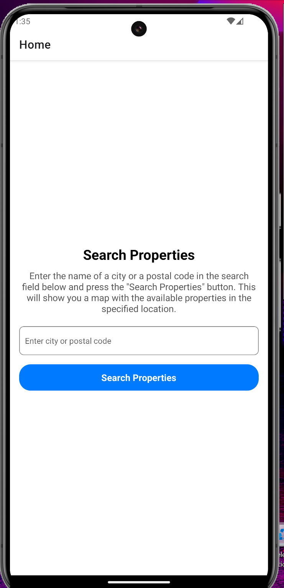

# Welcome to your Expo app 👋

This is an [Expo](https://expo.dev) project created with [`create-expo-app`](https://www.npmjs.com/package/create-expo-app).

## Get started

1. Install dependencies

   ```bash
   npm install
   ```

2. Start the app

   ```bash
    npx expo start
   ```

In the output, you'll find options to open the app in a

- [development build](https://docs.expo.dev/develop/development-builds/introduction/)
- [Android emulator](https://docs.expo.dev/workflow/android-studio-emulator/)
- [iOS simulator](https://docs.expo.dev/workflow/ios-simulator/)
- [Expo Go](https://expo.dev/go), a limited sandbox for trying out app development with Expo

You can start developing by editing the files inside the **app** directory. This project uses [file-based routing](https://docs.expo.dev/router/introduction).

## Get a fresh project

When you're ready, run:

```bash
npm run reset-project
```

This command will move the starter code to the **app-example** directory and create a blank **app** directory where you can start developing.

## Learn more

To learn more about developing your project with Expo, look at the following resources:

- [Expo documentation](https://docs.expo.dev/): Learn fundamentals, or go into advanced topics with our [guides](https://docs.expo.dev/guides).
- [Learn Expo tutorial](https://docs.expo.dev/tutorial/introduction/): Follow a step-by-step tutorial where you'll create a project that runs on Android, iOS, and the web.

## Join the community

Join our community of developers creating universal apps.

- [Expo on GitHub](https://github.com/expo/expo): View our open source platform and contribute.
- [Discord community](https://chat.expo.dev): Chat with Expo users and ask questions.


## App Test RealEstateSearchApp

```markdown
# RealEstateSearchApp

## Description
This is a mobile application project developed with React Native and Expo. The app allows users to search for properties by location and view details about each property.

## Application Structure
The structure of the application is as follows:

```
/application-name
│
├── /assets                # Folder for resources like images
│
├── /components            # Reusable components
│
├── /screens               # Application screens
│   ├── map.tsx   # Search screen
│   └── property-details.tsx # Property details screen
│
├── /navigation            # Navigation configuration
│   └── index.tsx          # Main navigation
│
├
│
├── package.json           # Dependency configuration file
│
└── README.md              # This file
```

## How to Run the Application

1. **Clone the repository:**
   ```bash
   git clone https://github.com/jbarrios23/RealEstateSearchApp.git
   ```

2. **Navigate to the project directory:**
   ```bash
   cd RealEstateSearchApp
   ```

3. **Install the dependencies:**
   Make sure you have [Node.js](https://nodejs.org/) and [Expo CLI](https://docs.expo.dev/get-started/installation/) installed. Then run:
   ```bash
   npm install
   ```

4. **Run the application:**
   ```bash
   npm start
   ```
   This will open a new window in your browser where you can run the application on an Android or iOS simulator, or on a physical device using the Expo Go app.

## Dependencies
- **React Native**: The core library for mobile application development.
- **Expo**: A tool to streamline development with React Native.
- **React Navigation**: To handle navigation between screens.

## Additional Notes
- Make sure you have an Android or iOS emulator set up if you want to test the application on a simulator.
- To run the application on a physical device, download the Expo Go app from the app store and scan the QR code that appears in the browser window.

## Valid Cities and Postal Codes for Consulting

San Francisco
Postal Code: 94103

Los Angeles
Postal Code: 90001

Las Vegas
Postal Code: 89101

New York
Postal Code: 10001

## Images

# Android

{ width=50% }

{ width=50% }

{ width=50% } 


# iOS

{ width=50% }

{ width=50% }

{ width=50% }

{ width=50% }


## Contributions
If you wish to contribute to this project, feel free to open an `issue` or create a `pull request`.

## License
This project is licensed under the MIT License. See the LICENSE file for more details.


## AI Tool Utilization

During the development of this application, an AI tool (such as GitHub Copilot or OpenAI's ChatGPT) was utilized to enhance the coding process and optimize various sections of the project. The following outlines how the AI tool was effectively integrated into the workflow:

### Code Generation
- **Fragment Generation**: The AI tool was leveraged to generate snippets of code for common components and functionalities, such as form handling, state management, and navigation setup. For instance, the initial structure of the `SearchScreen` component was created with the help of the AI, allowing for quicker development and focus on core functionalities.
  
- **Repetitive Tasks**: The AI assisted in writing boilerplate code, which reduced the time spent on repetitive tasks. This included creating similar components like property listing cards and input forms, ensuring consistency across the application.

### Code Optimization
- **Refactoring Suggestions**: The AI provided recommendations for refactoring certain sections of the code. For example, it suggested ways to simplify complex conditional statements and improve readability by using modern JavaScript features, such as destructuring and arrow functions.

- **Error Handling**: The AI was used to suggest best practices for error handling, helping to implement user-friendly alerts for invalid input or network issues, which improved the overall user experience.

### Documentation and Comments
- **Inline Documentation**: The AI helped generate inline comments and documentation for functions and components, making the codebase easier to understand for future developers or contributors.

### Learning and Guidance
- **Best Practices**: While coding, the AI provided insights into best practices for React Native development, including performance optimizations and efficient state management techniques. This guidance helped in adhering to industry standards.

### Conclusion
Utilizing an AI tool significantly accelerated the development process, allowing for a more efficient workflow and higher-quality code. It served as a valuable resource for both generating code and refining existing sections, ultimately contributing to the successful completion of the project.
